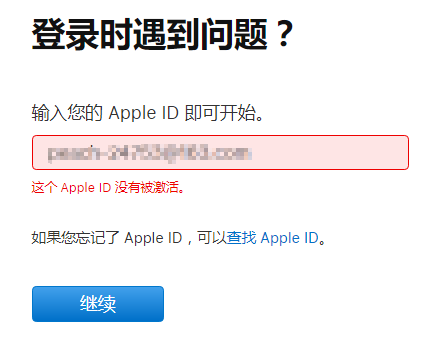

# 苹果ID登录提示没有被激活

为了更方便的下载外区的APP，不少人都拥有两个或以上AppleID。但最近后台有用户反映说外区ID在正常登录时会出现异常，手机经常会弹出窗口让输入密码登录，但是输入完正确的密码之后，手机却提示「这个人不在激活状态」，而且多次尝试后结果都一样。

到电脑网页端进入苹果账号管理页面，输入正确密码，网页仍然提示ID或者密码错误，尝试查找ID之后，被告知「这个AppleID没有被激活」。百思不得其解，密码没有问题啊，这是原因呢？\
\
**问题描述**：登录ID下载APP时，提示「这个人不在激活状态」怎么办？密码是正常的，但每次输入都提示没有激活，不在激活状态。

<figure><figcaption></figcaption></figure>

**解决办法**：遇到这种情况，多半是因为账号被系统判断为存在异常，因此进行了封禁，想要解决问题，必须寻求苹果的帮助。具体操作如下：

首先致电400-6668800，电话拨通之后根据提示进入AppleID服务选项，之后系统会自动为你转接对应的客服。

客服接通电话之后，跟客服说明情况，并提供被封的AppleID。

经过简单记录之后，客服会帮你解封账号，此时AppleID已经可以正常登陆了，但也仅限于登陆，还是无法购买下载APP。

解封ID之后，客服会帮你转接Apple Care团队。

同样的，跟客服说明情况并提供账号，然后客服会问你3个密保问题（当初创建账号时设置的密保问题），你只需要将这3个密保问题都答对，账号就能恢复正常了。

切记，3个密保问题都要答对，缺一不可。

所以说，密保问题真的很重要，大家一定好好牢记答案，有了密保答案，找苹果客服很多问题都可以第一时间解决。
