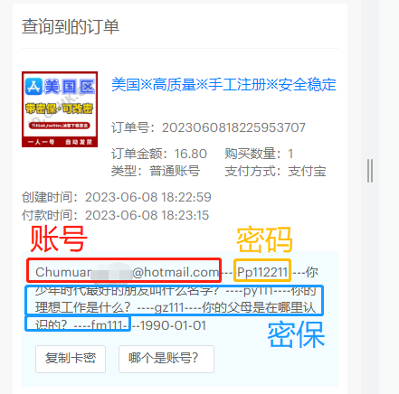

# 苹果ID发货格式（哪个是账号？密码？密保？）

#### **※一张图读懂账号密码※**

<figure><figcaption></figcaption></figure>

#### **※如果还没看得懂，那你继续往下看※**

#### **账号信息依次对应的顺序是：**

\
【**账号----密码----密保朋友----密保工作----密保父母----生日----国家**】

**英文问题代表意思:**

**问题1：What was the name of your best friend as a teenager?（你少年时代最好的朋友叫什么名字？）对应  111**\

**问题2：What is your dream job?（你的理想工作是什么？）对应  222**

**问题3：In what city did your parents meet?（你的父母是在哪里认识的？）对应  333**

#### **例如：**

【**cuibjuf97@163.com----Pp112211----你少年时代最好的朋友叫什么名字？----py111----你的理想工作是什么？----gz111----你的父母是在哪里认识的？----fm111----1990-01-01----国家**】

#### **对应：（请不要使用下方的卡密信息，那只是案例！）**

\
<mark style="color:red;">**登录账号：**</mark>~~<mark style="color:red;">**cuibjuf97@163.com**</mark>~~

<mark style="color:red;">**登录密码：**</mark>~~<mark style="color:red;">**Pp112211**</mark>~~

<mark style="color:red;">**密保朋友：**</mark>~~<mark style="color:red;">**py111**</mark>~~

<mark style="color:red;">**密保工作：**</mark>~~<mark style="color:red;">**gz111**</mark>~~

<mark style="color:red;">**密保父母：**</mark>~~<mark style="color:red;">**fm111**</mark>~~

<mark style="color:red;">**您的生日：**</mark>~~<mark style="color:red;">**1990-01-01**</mark>~~

<mark style="color:red;">**所属国家：**</mark>~~<mark style="color:red;">**国家**</mark>~~

***

\
