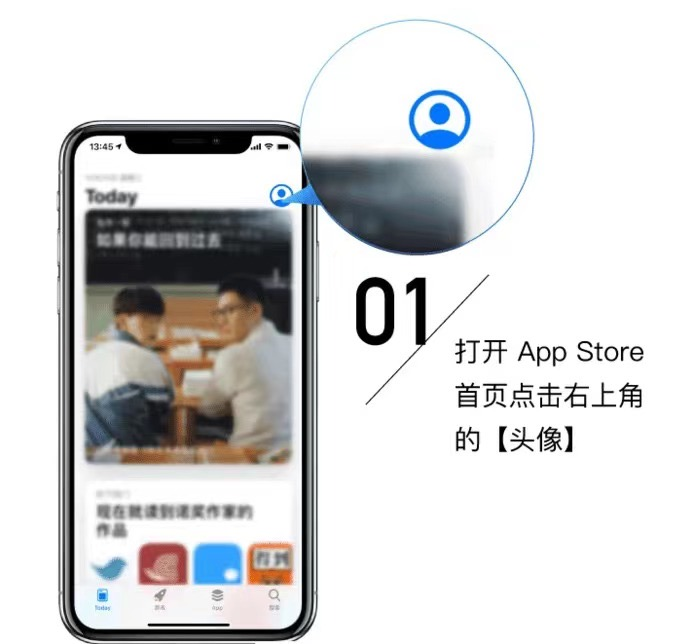
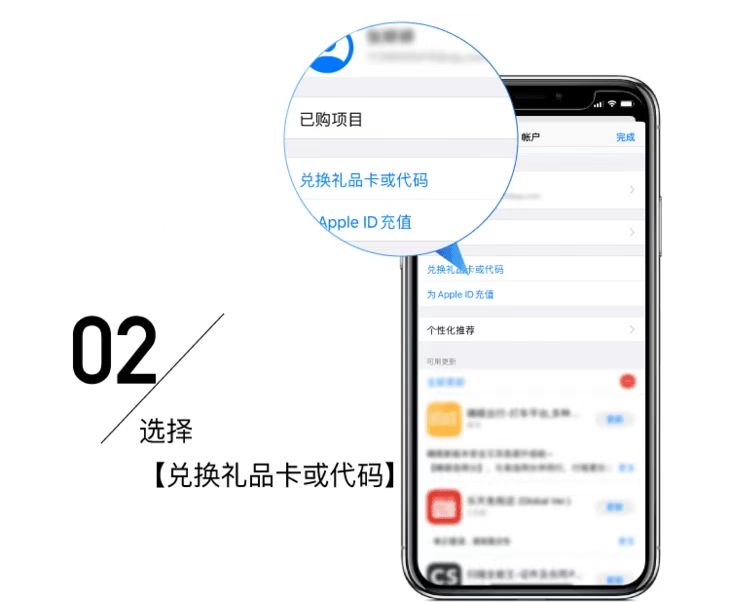
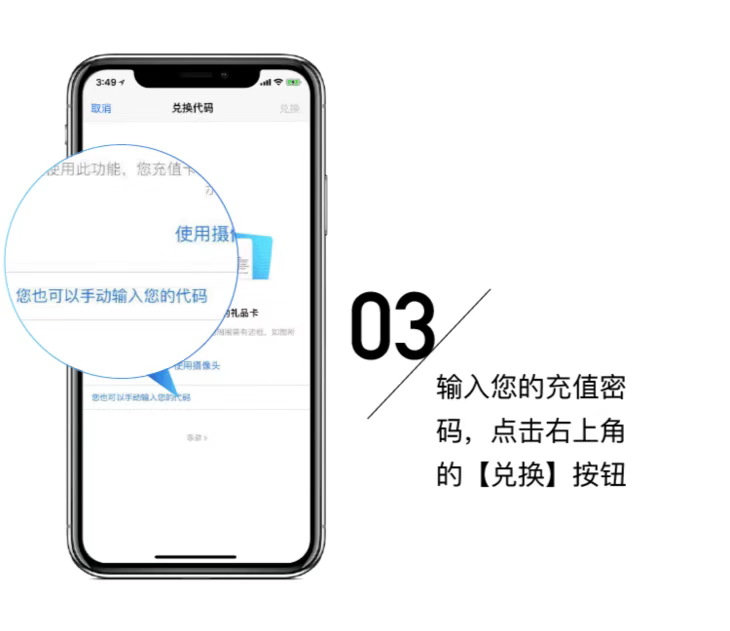

# 苹果ID礼品卡兑换教程

**1.打开AppStore之后，点右上角蓝色头像。**&#x20;

<figure><figcaption></figcaption></figure>

**2.找到"兑换礼品卡或代码"，并点击。**&#x20;

<figure><figcaption></figcaption></figure>

**3.即可兑换Apple礼品卡(有摄像头扫描和手动输入两种方式)。**

<figure><figcaption></figcaption></figure>
