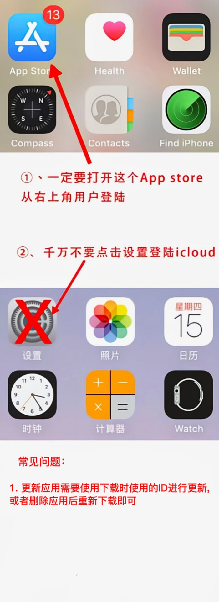

# 苹果ID账号怎么登录？在哪登陆？

<figure><figcaption></figcaption></figure>

<figure><figcaption></figcaption></figure>

**出现无法登录：**\
\
1.大部分出现登录时候提示【账号密码错误】都是自己输入错误，认真输入几次试试实在登录不上联系售后客服！

2.如果帐号登录上去，一直转圈，这个是ios服务器的问题，您可以更换一下网络，或者重新开机。

3.更新APP需要您登录原来下载APP的那个账号，不是现在的。您只能卸载，重新下载。

4.普通的苹果ID只能下载免费APP，付费APP需要您购买礼品卡。

5.仅用于登陆AppStore（下载APP），切勿登陆iCloud（设置ID），如有必要请登陆后关闭查找iPhone。

**特别注意：**

不能用我们发的号更新你手机上原来的软件，只能卸载重新下载，这是苹果强制规定的。

之前用其他的ID下载的那个软件，然后现在更新用的是我这里买的ID，两个ID不一样，就不能更新，就会出现那个iTunes已停用的提示

<mark style="color:red;">**更新应用需要使用下载时所使用的ID进行更新或者删除应用之后重新下载即可。**</mark>

如果买来的id，最好买后第一时间改密码密保，并妥善保管。

不要登陆icloud，不要在设置里面的apple id那里登陆账号，**一定要在app store处也就是苹果商店那里登陆苹果账号**。
