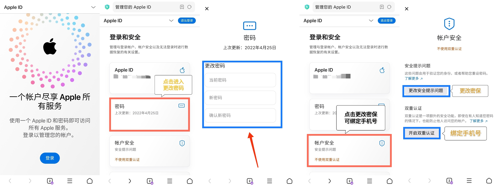

# 苹果ID账号怎么修改密保信息？

<mark style="color:red;">**1.请用国内网络！不要开启代理。**</mark>

<mark style="color:red;">**2.打开ID官网:**</mark>[<mark style="color:red;">**https://appleid.apple.com**</mark>](https://appleid.apple.com/)

<mark style="color:red;">**3.点击登录。**</mark>

<mark style="color:red;">**4.先不要升级双重认证，绑定手机号！不然会更改不了密保！先选择其他选项，点击不升级。**</mark>

<mark style="color:red;">**5.登陆后点击密码，然后更改密码。**</mark>

<mark style="color:red;">**6.点击账户安全，更改安全问题设置好问题和答案，开启双重验证**</mark>

<mark style="color:red;">**7.选择个人信息，然后选取“出生日期”**</mark>

<mark style="color:red;">**8.更新您的出生日期，然后点按“存储”**</mark>

<mark style="color:red;">**9.如果你不幸绑定的双重认证，点击查看《**</mark>[<mark style="color:red;">**账号解锁与找回**</mark>](https://hao.744.cn/blog/20.html)<mark style="color:red;">**》**</mark>

<figure><figcaption></figcaption></figure>

