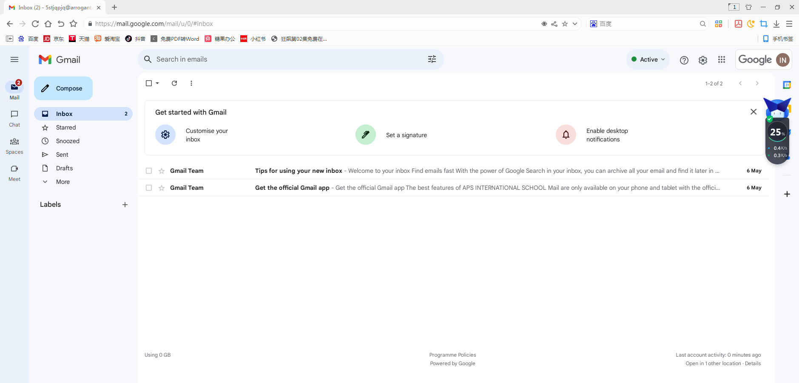

# 谷歌企业邮箱登录教程

### **第一步：打开谷歌邮箱（**[**https://mail.google.com**](https://mail.google.com/)[**/**](https://mail.google.com/)**）点击右上角登录** 

<figure><figcaption></figcaption></figure>

### **第二步：在我们的ID商城（广告位招租）购买邮箱账号** 

**付款成功后,你会收到:Google用户名----密码----辅助邮箱**\
**例如:（这是例子，不要用例子账号密码去登录，登录需要自己购买）**\
**5STjQpjQ@arrogant.cc----4XSIIZw----zoq45SY**[**a@outlook.com**](http://mailto:a@outlook.com/)\
**则对应:**\
**邮箱账号:5STjQpjQ@arrogant.cc**\
**邮箱密码:4XSIIZw**\
**辅助邮箱:zoq45SY**[**a@outlook.com**](http://mailto:a@outlook.com/)

### **第三步：在谷歌官网输入收到的账号，然后点击下一步** 

<figure><figcaption></figcaption></figure>

### **第四步：输入密码后点击下一步** 

<figure><figcaption></figcaption></figure>

### **第五步：点击“我理解”按钮** 

<figure><figcaption></figcaption></figure>

### **到这里就完成喽** 

<figure><figcaption></figcaption></figure>
