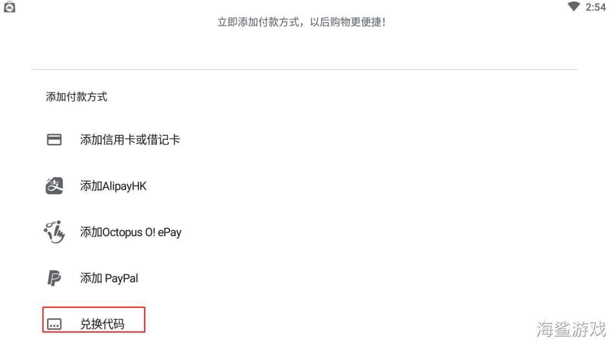
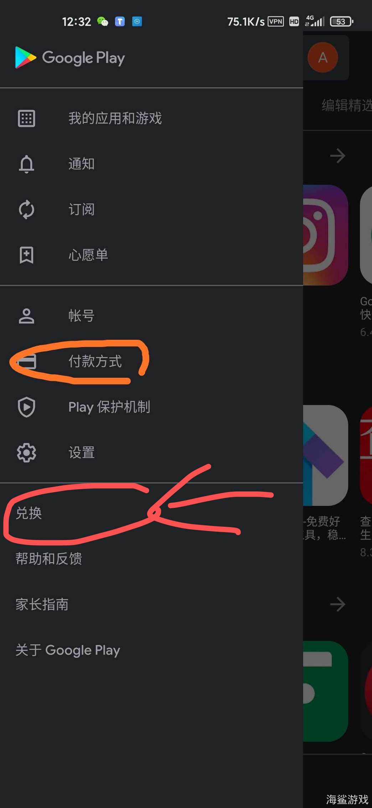
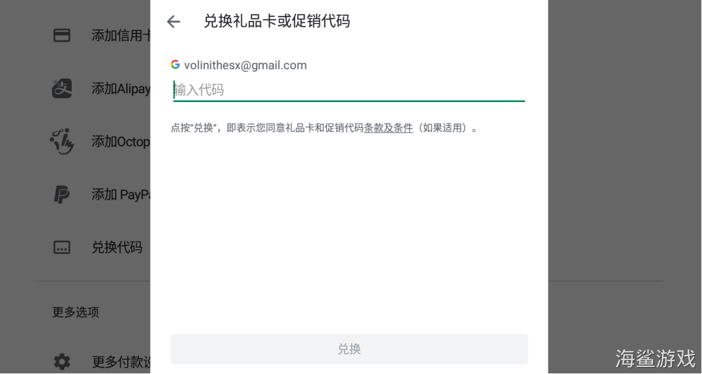
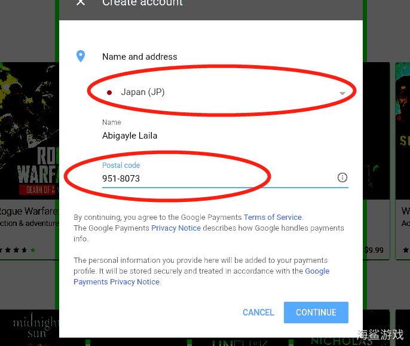
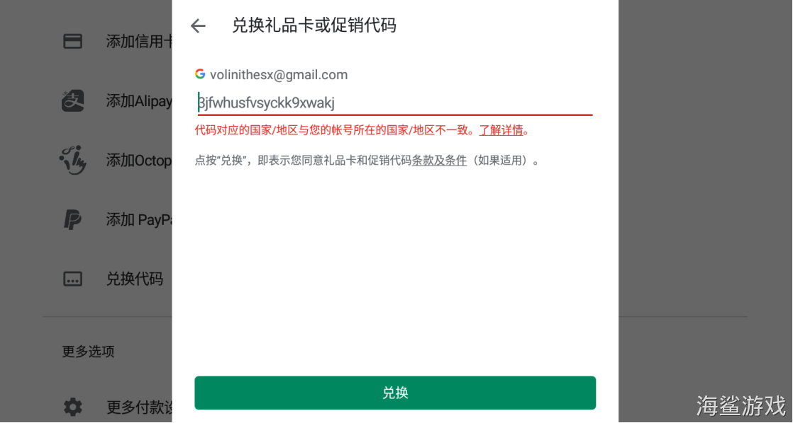

# 谷歌账号（新号转国家）教程

<mark style="color:orange;">**1.打开谷歌商城，登录新的账号，点击右侧三个杠**</mark>

<figure><figcaption></figcaption></figure>

<mark style="color:orange;">**2.打开付款方式，付款方式选择兑换代码（部分设备付款方式内没有兑换，请看下面的图3哦）**</mark>

<figure><figcaption></figcaption></figure>

<figure><figcaption></figcaption></figure>

<mark style="color:orange;">**部分商店请点击兑换，不用点付款方式**</mark>

<figure><figcaption></figcaption></figure>

<mark style="color:orange;">**3.输入兑换代码：5dqwe47f41v4zx1dfda，并确认充值**</mark>

<figure><figcaption></figcaption></figure>

<mark style="color:orange;">**4.选择需要更改为的国家，填写邮编或者手机号后， 点击继续**</mark>

<mark style="color:orange;">**日本邮编:951-8073   日本电话号码:080-77903227**</mark>

<mark style="color:orange;">**韩国邮编:04538   韩国手机号:010-88903116**</mark>

<mark style="color:orange;">**台湾邮编:334203   台湾手机号:0932-573689**</mark>

<mark style="color:orange;">**香港邮编:999077   香港手机号:852-96903116**</mark>

<mark style="color:orange;">**菲律宾邮编:6030   菲律宾手机号:09896279486**</mark>

<mark style="color:orange;">**马来西亚邮编:43200   马来西亚手机号:0169876543**</mark>

<mark style="color:orange;">**印度尼西亚邮编:11460   印度尼西亚手机:0621234567**</mark>

<mark style="color:orange;">**新加坡邮编:999002   新加坡手机号:06566413982**</mark>

<mark style="color:orange;">**泰国邮编:10900   泰国手机号:066837656569**</mark>

<figure><figcaption></figcaption></figure>

<figure><figcaption></figcaption></figure>

<mark style="color:orange;">**5.出现以下情况，点击回到主页，账号转区已完成**</mark>

<figure><figcaption></figcaption></figure>
