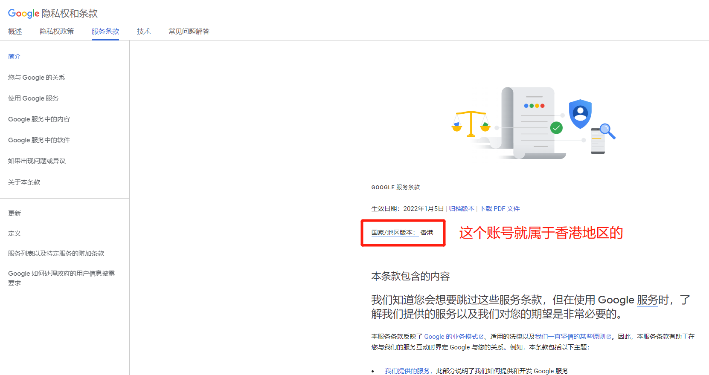
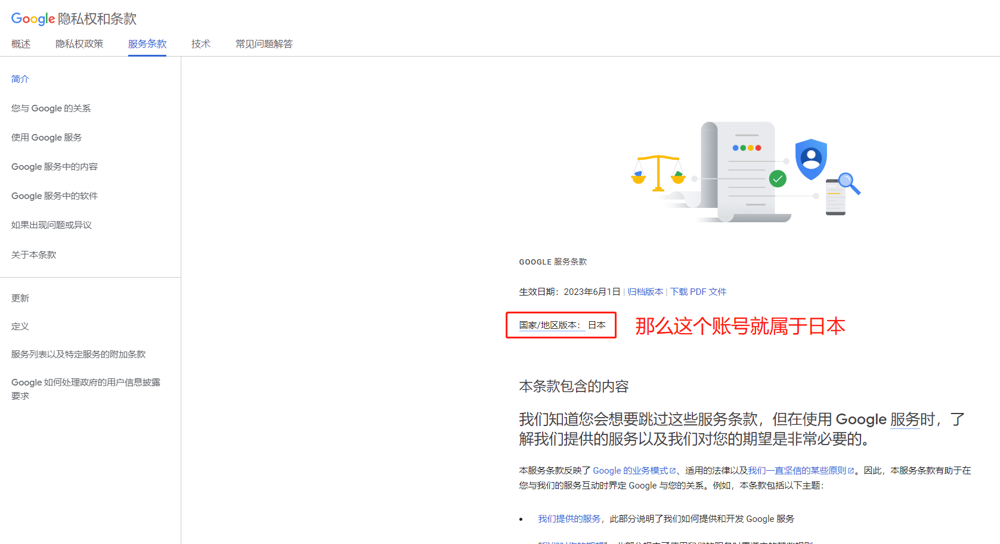

# 谷歌账号怎么判断归属国家地区

今天来给大家揭秘普通Google账号怎么分辨所属国家。

**首先我们打开Google隐私条款网址** [**https://policies.google.com/terms**](https://policies.google.com/terms)

打开这个页面以后，**它会在醒目的位置标出我们的google账号的国家/地区版本**

<mark style="color:red;">**注意：必须先登录账号再打开喔...**</mark>

这个版本指的是我们的账号使用的哪个国家地区的条款，

如果它把我们的账号归类为中国，那就代表系统把我们的账号划分为中国地区

如下图

<figure><figcaption></figcaption></figure>

<figure><figcaption></figcaption></figure>
