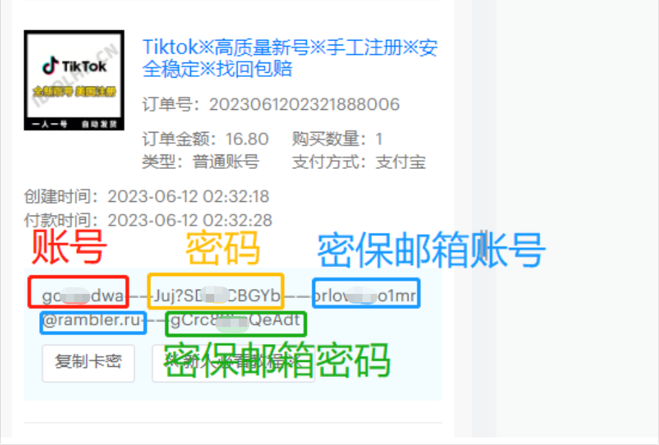

# 一张图读懂TikTok账号密码格式

**当你支付成功之后，会收到这一串秘钥**

<mark style="color:red;">**把它拆开就是Tiktok的账号密码密保邮箱账密**</mark>

<figure><figcaption></figcaption></figure>

<mark style="color:red;">**IOS登录步骤：**</mark>

**1、拔掉手机sim卡 → 打开系统设置 → 通用 → 语言与地区 → iPhone语言改为“中文繁体” → 地区可改为“英国等国家”！**

**2、完成第一步后，再重新安装tiktok，保证没有缓存数据！**

**3、打开魔法上网，重新使用连接即可！**

<mark style="color:red;">**安卓登录步骤：**</mark>

**1、拔掉手机sim卡 → 打开系统设置 → 切换语言为“English”！**

**2、完成第一步后，再重新安装tiktok，保证没有缓存数据！**

**3、打开魔法上网，重新使用连接即可！**

**注意：登录需将加速器节点设置为全局加速登录完成后请勿随便退出！**
