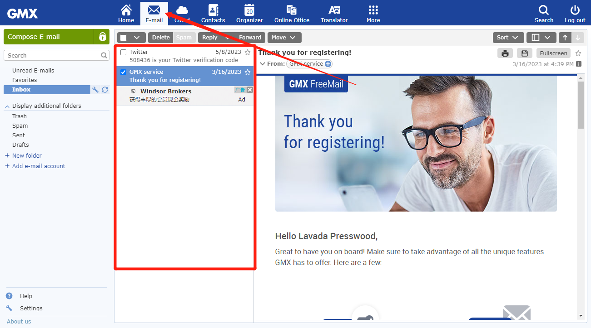

# GMX和微软邮箱使用教程

### **GMX邮箱登录地址：**[**https://www.gmx.com**](https://www.gmx.com/)[**/**](https://www.gmx.com/) 

**微软邮箱登录地址：**[**https://outlook.live.com/owa**/](https://outlook.live.com/owa/)

<figure><figcaption></figcaption></figure>

<figure><figcaption></figcaption></figure>

<figure><figcaption></figcaption></figure>

<figure><figcaption></figcaption></figure>

<figure><figcaption></figcaption></figure>

<figure><figcaption></figcaption></figure>

<figure><figcaption></figcaption></figure>

<figure><figcaption></figcaption></figure>

<figure><figcaption></figcaption></figure>

### **登录后，点击这个邮件按钮，即可看到 邮件信息！** 

