# hotmail微软邮箱“帐户已锁定”怎么办？

**由于微软邮箱安全升级，没有绑定密保手机的，会锁定账号，下面教程教你如何解锁微软邮箱**

**如果不愿意看图文的朋友，可以去看视频：**[**https://video.744.cn/index.php/play/10.html**](https://video.744.cn/index.php/play/10.html)

**1.当登录微软邮箱提示“账户已锁定”不要慌，点击下一步**

<figure>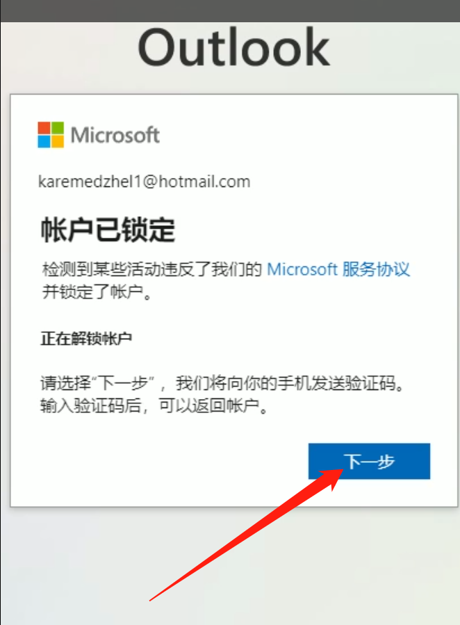<figcaption></figcaption></figure>

**2.输入您的手机号，点击“发送代码”**

<figure>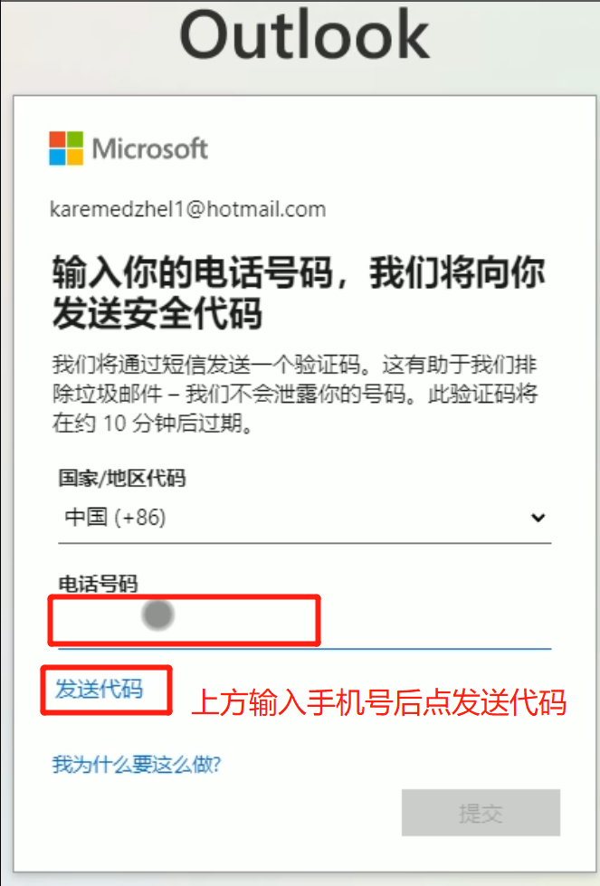<figcaption></figcaption></figure>

**3.输入你收到的短信验证码，然后点击提交**

<figure>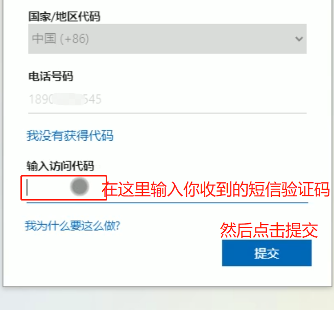<figcaption></figcaption></figure>

**4.短信验证通过后。成功解锁阻止，点击继续。**

<figure>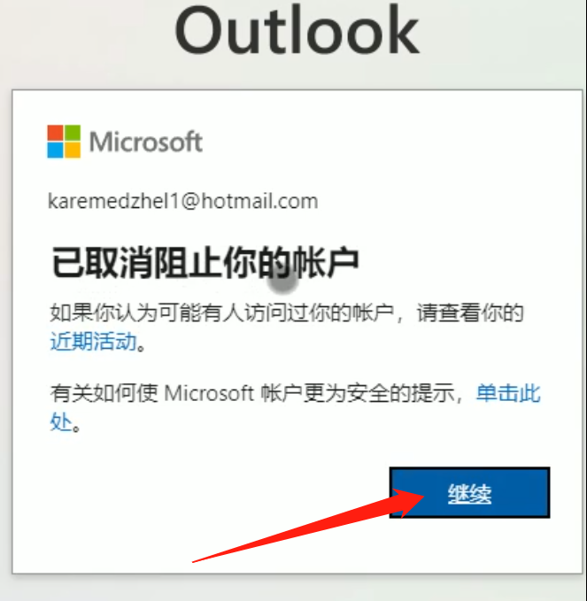<figcaption></figcaption></figure>

**5.在输入框输入一个手机号码、或者电子邮箱地址。**

<figure>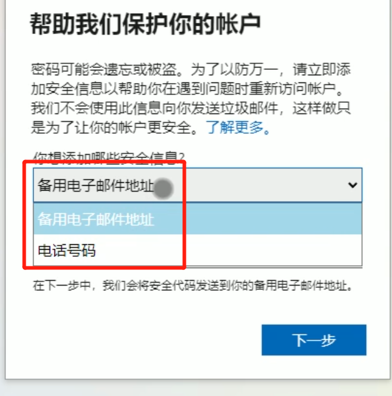<figcaption></figcaption></figure>

<figure>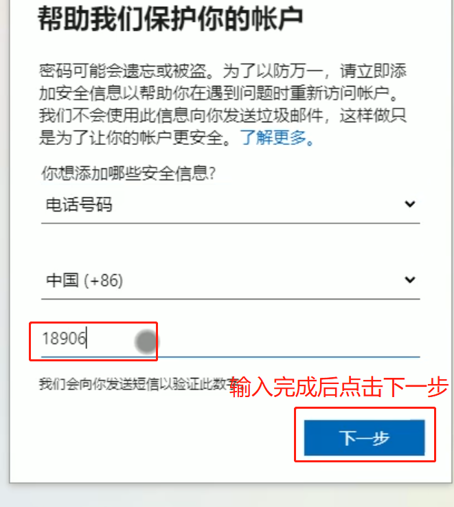<figcaption></figcaption></figure>

**6.输入你的收到的验证码，然后点击下一步**

<figure>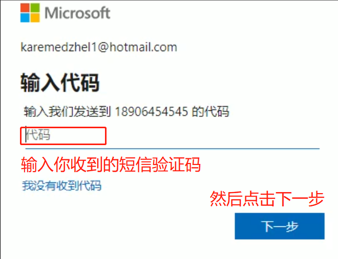<figcaption></figcaption></figure>

**7.输入手机号后4位，然后点击发送验证码**

<figure>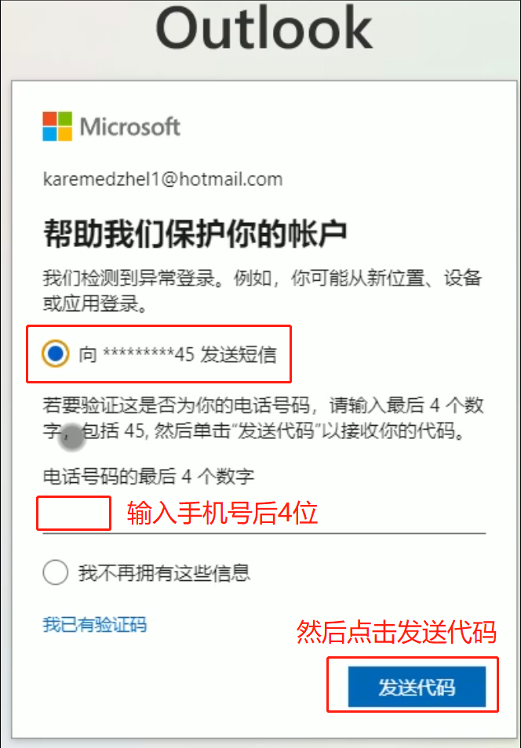<figcaption></figcaption></figure>

**8.输入收到的短信验证码，点击下一步**

<figure>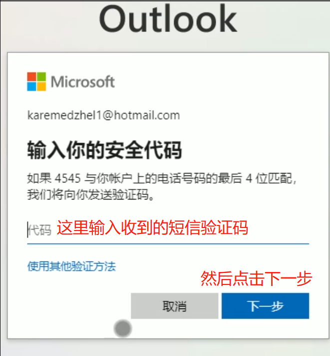<figcaption></figcaption></figure>

**9.点击是**

<figure>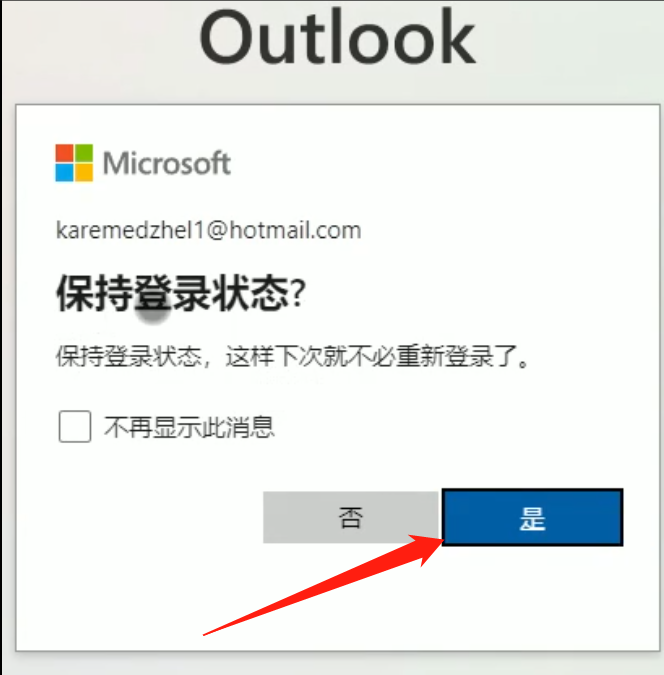<figcaption></figcaption></figure>

**10.一般第5条信息就是推特的确认码**

<figure>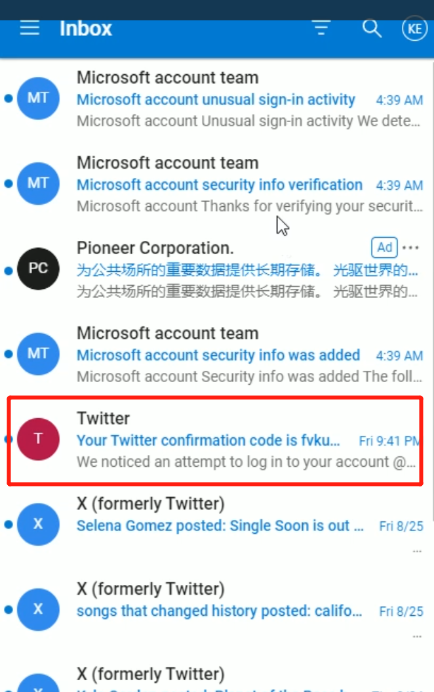<figcaption></figcaption></figure>
