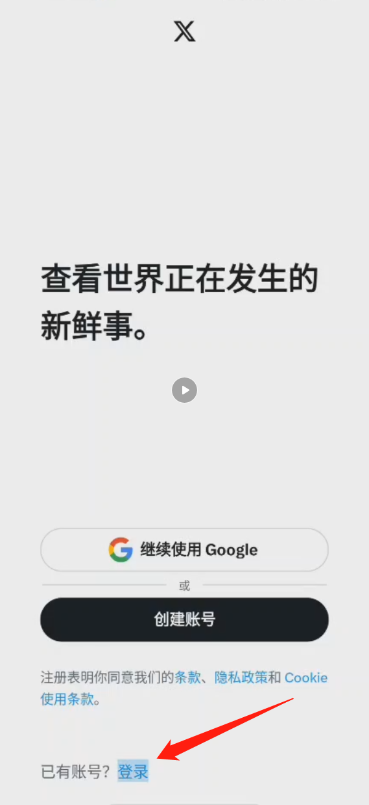
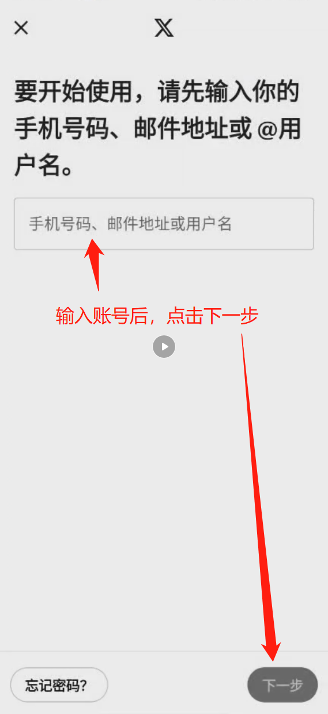
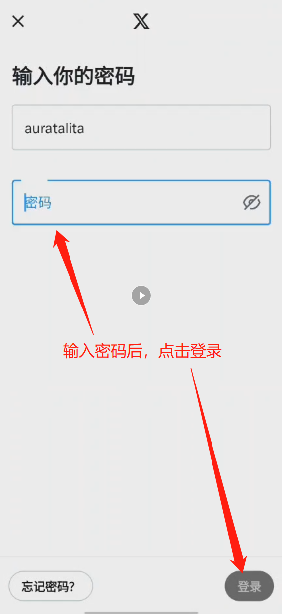
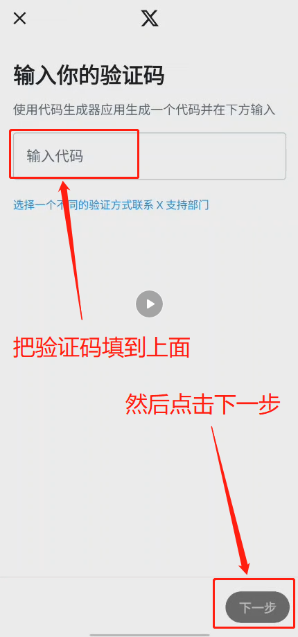
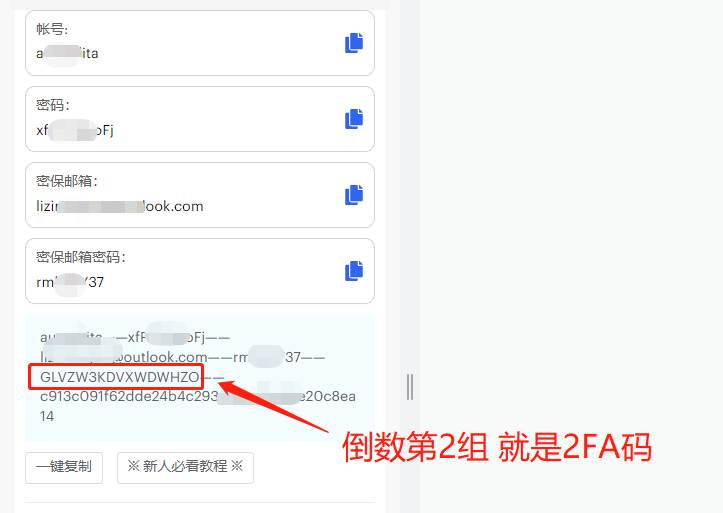
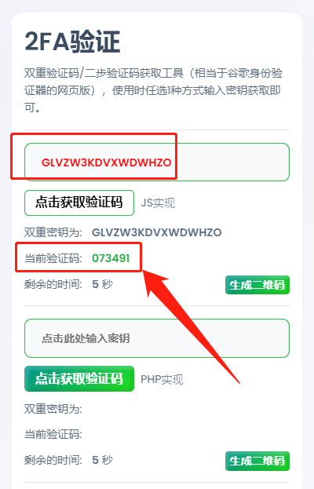

# 推特通过2FA登录教程

第一步：点击登录

\

**第二步：输入账号，点击下一步**

<figure><figcaption></figcaption></figure>

**第三步：输入密码后点击登录**

<figure><figcaption></figcaption></figure>

**第四步：重点来了！**

**要看清楚是“**<mark style="color:orange;">**验证码**</mark>**”还是“**<mark style="color:red;">**确认码**</mark>**”**

<mark style="color:orange;">**是验证码继续往下看**</mark>

**如果是确认码去看另一个教程：**[**推特登录教程**](tui-te-zhang-hao-deng-lu-xiang-xi-jiao-cheng.md)

<figure><figcaption></figcaption></figure>

**第五步：浏览器打开** [**https://2fa.run**](https://2fa.run) **把账号的2FA填进去**

<figure><figcaption></figcaption></figure>

<figure><figcaption></figcaption></figure>
