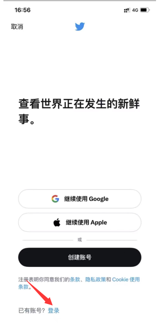
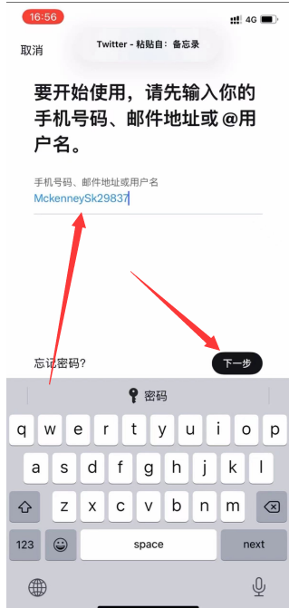
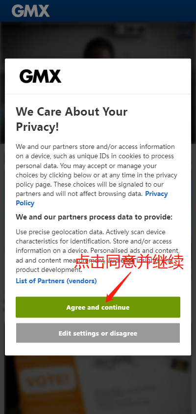

# 推特账号登录详细教程

**推特登录前准备方法：**

**1、打开魔法上网然后打开【推特APP】或**[**【**](https://twitter.com/)[**https://twitter.com**](https://twitter.com/)[**】**](https://twitter.com/)**输入用户名密码（需要开启国外ip）点下一步按钮， 按提示操作就可以了，输入给你的号码或者邮箱，点击下一步，成功登录**

**1、建议你清理本地缓存cooks，确保我们使用的伽速器IP质量干净，就是没有用来恶意注册过推特的IP地址。如果经常使用垃圾IP，是很容易封号哦。**

**2、不要频繁切换IP，你使用一个线路登陆的，就每次使用这个线路，不然频繁更换也是导致账号被封的常见原因。**

**3、遵循推特的平台使用规则，不要发布乱七八糟的信息，才能保持账号持久使用！**

**图文教程：**

**第一步：登录推特**\

<figure><figcaption></figcaption></figure>

### **第2步：在输入框输入购买的账号，点下一步** 

<figure><figcaption></figcaption></figure>

### **第3步：在输入框输入密码点下一步** 

**第4步:如需确认码，登录邮箱(**[**https://www.gmx.com/mail**](https://www.gmx.com/mail/)[**/**](https://www.gmx.com/mail/)**)查看确认码**

**【**[**点我GMX邮箱使用教程**](gmx-he-wei-ruan-you-xiang-shi-yong-jiao-cheng.md)**】**

\

### **第5步:返回推特网站,输入确认码** 

<figure><figcaption></figcaption></figure>

**第六步：在GMX邮箱里面找到发来的验证码**

<figure><figcaption></figcaption></figure>

**第七步：输入到推特验证即可登录！**

<figure><figcaption></figcaption></figure>

**温馨提示：看看就好，请勿发表涉及敏感话题的内容。**
