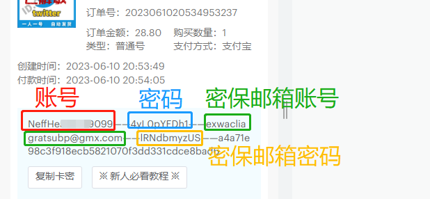
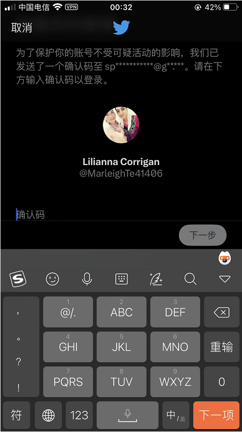
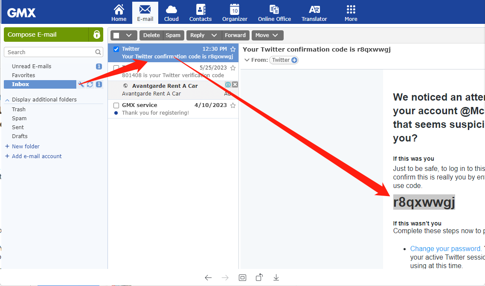

# 一张图读懂推特账号密码格式

**当你支付成功之后，会收到这一串秘钥**

<mark style="color:red;">**把它拆开就是推特的账号密码**</mark>**密保邮箱账密**

<figure><figcaption></figcaption></figure>

**第一次登陆，会提示输入确认码**

**这个时候登录密保邮箱就能看到了**

**邮箱登录地址：**[**www.gmx.com**](https://www.gmx.com/)

**不会登陆的看下面教程**

**邮箱登录步骤：**[**点击此处**](gmx-he-wei-ruan-you-xiang-shi-yong-jiao-cheng.md)

<figure><figcaption></figcaption></figure>

<figure><figcaption></figcaption></figure>
